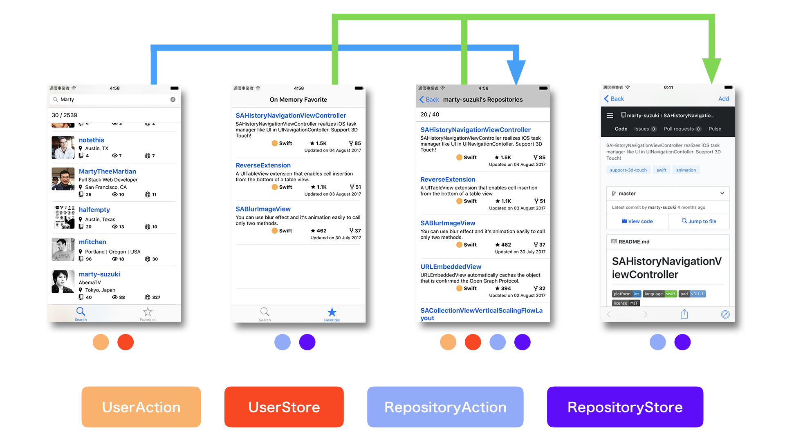

# Flux Sample with FluxCapacitor

## Requirements

- Swift 4.0.3 or later
- iOS 9.0 or later

## Installation

To run the example project, clone the repo, and run `pod install` and `carthage update` from the Example directory first. In addition, you must set Github Personal access token.

```swift
extension ApiSession: ApiSessionType {
    static let shared: ApiSession = {
        let token = "" // Your Personal Access Token
        return ApiSession(injectToken: { InjectableToken(token: token) })
    }()
}
```

Application structure is like below.



- [SearchViewController](./FluxCapacitorSample/Sources/UI/Search) (with RxSwift) You can search Github user.
- [FavoriteViewController](./FluxCapacitorSample/Sources/UI/Favorite) You can stock favorites on memory.
- [UserRepositoryViewController](./FluxCapacitorSample/Sources/UI/UserRepository) You can display a user's repositories.
- [RepositoryViewController](./FluxCapacitorSample/Sources/UI/Repository) You can display webpage of repository, and add favorites on memory.

[This](./FluxCapacitorSampleTests) is test code.

[GithubKitForSample](https://github.com/marty-suzuki/GithubKitForSample) is used in this sample project.

## Author

marty-suzuki, s1180183@gmail.com

## License

FluxCapacitor is available under the MIT license. See the LICENSE file for more info.
